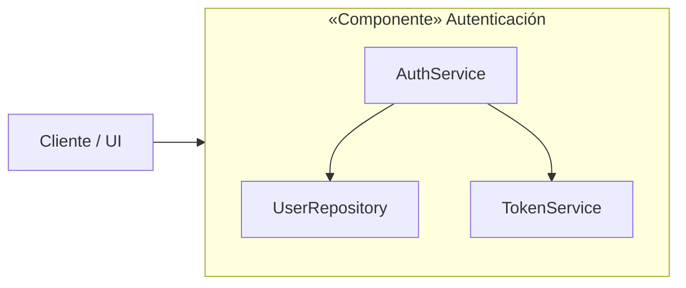
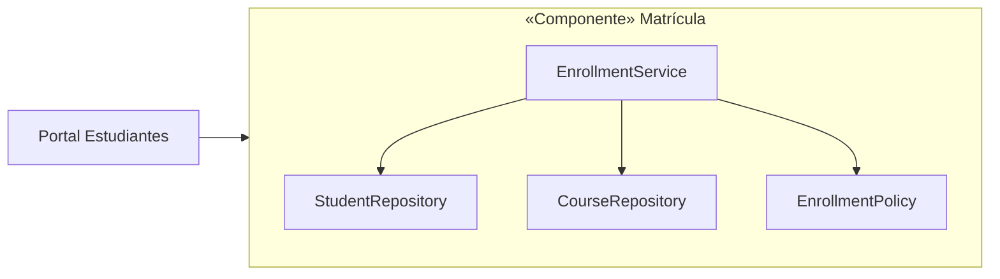

# 📘 Componentes de Software

## Ejemplos con Diagramas y Código en Python

---

# 1. 🧩 Componente de Autenticación

## 📌 Diagrama del Componente



---

## 📦 Estructura del Componente

```
auth_component/
 ├── auth_service.py
 ├── token_service.py
 └── user_repository.py
```

---

# 2. 🎓 Componente de Matrícula Estudiantil

## 📌 Diagrama del Componente



---

## 📦 Estructura del Componente

```
enrollment_component/
 ├── repositories.py
 ├── policy.py
 └── enrollment_service.py
```
