# Tienda de barrio

## Roles
- __Dueño Tienda:__ Persona a la que pertenece la tienda.
- __Tendero:__ Persona que se encarga de despachar y organizar los pedidos. usualmente suele ser el mismo dueño de la tienda.
- __Cliente:__ Persona que compra los productos a la tienda.
- __Domiciliario:__ Es la persona que se encarga de llevar los pedidos solicitados de la tienda a donde el cliente especíca.

## Procesos
- Venta de productos
- Gestión de pedidos
- Preparación de pedidos
- Despacho de pedidos.
- Mercadeo.

## Funcionalidades del Software:

__Venta de productos:__
- Crear pedido de compra
- Pago del envío con tarjeta crédito.
- Pago del envío con tarjeta débito.
- Pago en efectivo.
- Devolución de pago en caso de eventualidad.
- Confirmación de pago.
- Identificar el cliente
- Visualizar el histórico de las compras.

__Gestión de pedidos:__
- Atender un pedido de compra.
- Validar que el pedido haya sido atendido.
- Asegurar que en el inventario cuente con los productos especificados.
- Permitir realizar un pedido personalizado.
- Comunicación con cliente sobre aclaraciones del pedido.
- Agendar entrega de pedido.
- Visualizar los pedidos realizados.

__Preparación de pedidos:__
- Reducir del inventario los productos.
- Confirmación del pedido alistado.
- Identificar lugar de entrega.
- Generar factura de compra.

__Despacho de pedidos:__
- Buscar un domiciliario disponible.
- Confirmar el domiciliario al cliente.
- Visualizar la ubicación de mi pedido.
- Seleccionar la ruta optima de entrega de los pedidos.

__Mercadeo:__
- Permitir identificar tendencias de compra.
- Sugerir promociones con base en productos a perecer.
- Identificar los productos menos y más vendidos.
- Permitir crear promociones personalizadas a clientes.

## Historias de usuario

1. Como comprador deseo solicitar a mi tendero productos desde mi computador para facilitar mis compras.
2. Como comprador deseo solicitar a mi tendero productos desde mi celular para facilitar mis compras.
3. Como tendero deseo tener una lista ordenada de los pedidos recibidos para poder despacharlos y no perder ninguno.
4. Como tendero deseo poder administrar la lista de pedidos recibidos para poder organizar mi negocio.
5. Como comprador deseo programar la hora de recepción de mis pedidos para poder planear mejor mis actividades.
6. Como cliente deseo seleccionar productos y agregarlos a mi pedido de forma gráfica para facilitar mi forma de compra.
7. Como tendero deseo que los productos ofertados estén enlazados con mi inventario para poder ofrecerles productos en existencia a sus compradores.
8. Como tendero deseo tener control de mi inventario para saber qué productos necesito conseguir para tener un inventario atractivo a mis compradores.
9. Como tendero deseo conocer por medio de avisos los productos que están por terminarse de mi inventario para tener un inventario atractivo a mis compradores.
10. Como tendero deseo tener reportes que me permitan ver los productos que tienen mayor solicitud y cuales no para poder abastecer mejor mi tienda.
11. Como comprador deseo tener un recordatorio de mis pedidos más frecuentes según mis preferencias para ayudarme a organizar mis compras.
12. Como comprador deseo ver un historial de mis compras para conocer mis gastos.
13. Como comprador deseo poder solicitar productos a diferentes tenderos para tener más opciones y variedad.
14. Como comprador deseo realizar pedidos seleccionando el producto y que el pedido se distribuya a diferentes tenderos según las mejores ofertas.
15. Como tendero deseo crear campañas promocionales, e informar a mis clientes para mejorar mi negocio.
16. Como comprador deseo buscar promociones según mis preferencias para obtener mejores beneficios.
17. Como comprador deseo que mi ubicación sea obtenida automáticamente para facilitar el uso de la aplicación.
18. Como tendero deseo que la orden lista genere una factura sea impresa para entregársela al domiciliario y este al comprador.
19. Como domiciliario deseo agrupar mis entregas para hacer más efectivo mi trabajo.

## Diagramas de arquitectura

__Organización:__
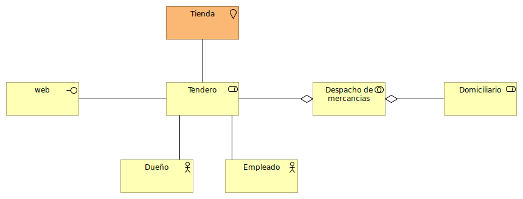

__Actor Cooperación:__

__Función de Negocio:__
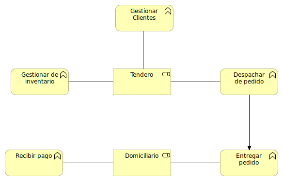

__Proceso de Negocio:__
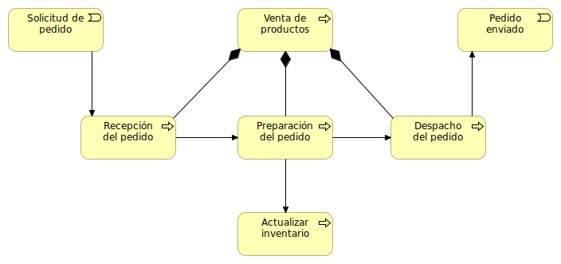

__Cooperación de Proceso de Negocio:__
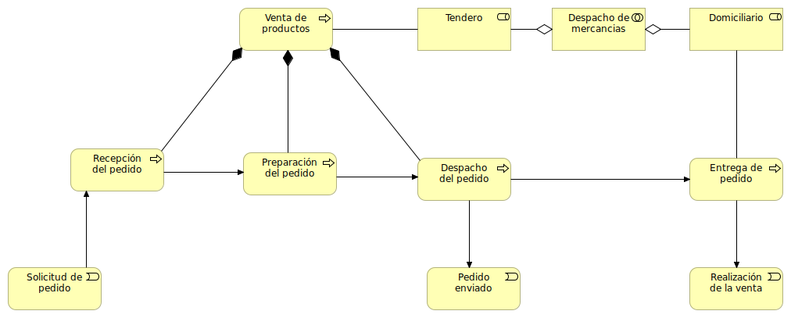

__Producto:__
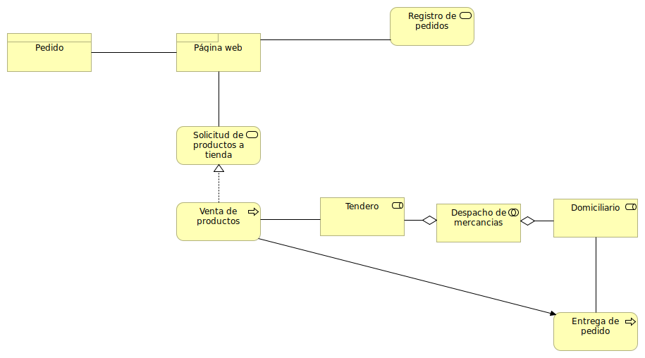

__Comportamiento de Aplicación:__
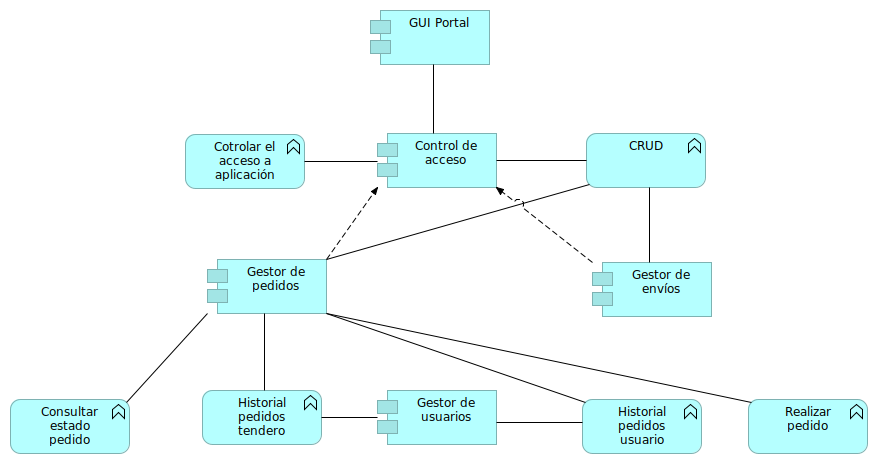

__Cooperación de Aplicación:__
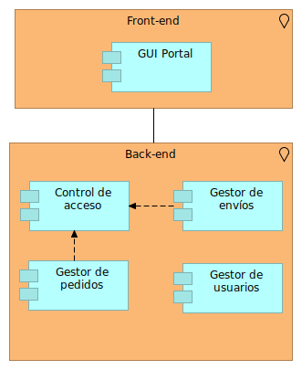

__Estructura de Aplicación:__
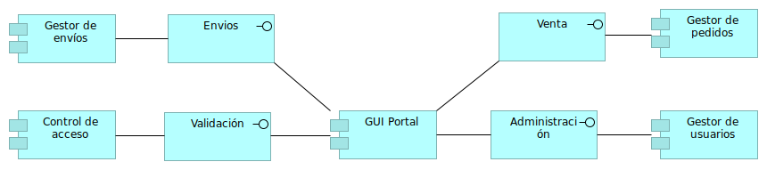

__Uso de Aplicación:__
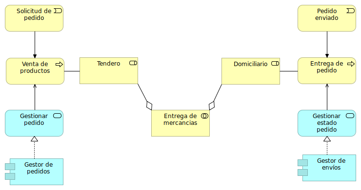

__Infraestructura:__
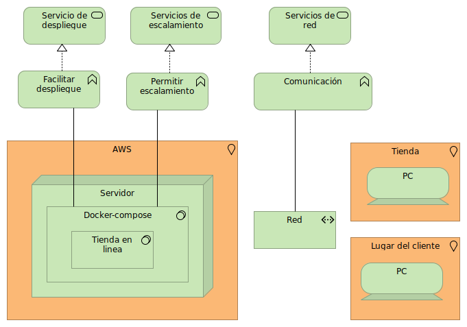

__Uso de Infraestructura:__
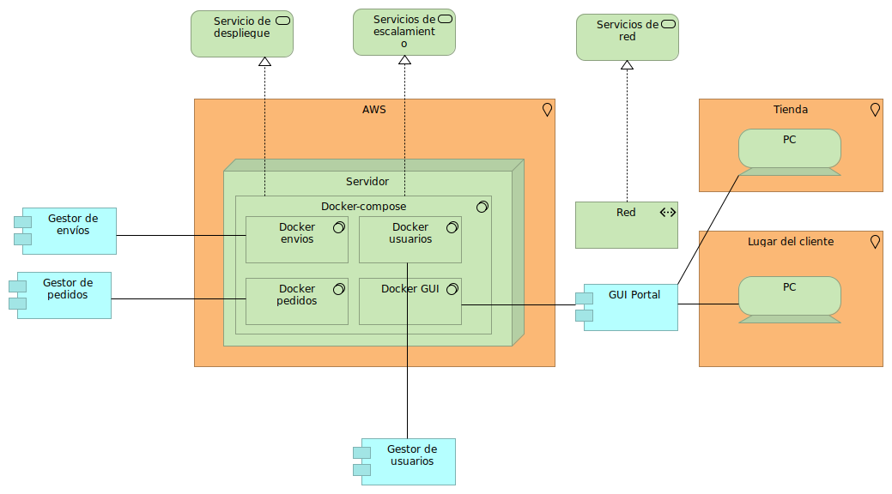

__Organización e Implementación:__
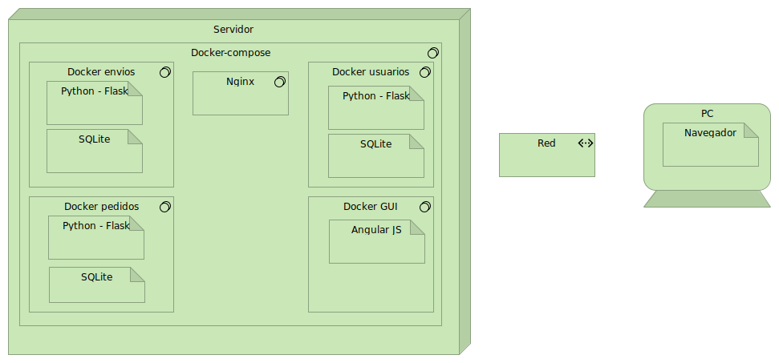

__Estructura de Información:__
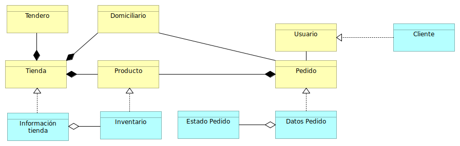

__Realización del Servicio:__
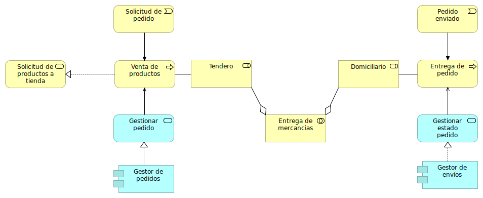

__Por capas:__
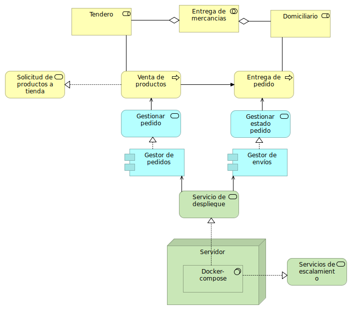
